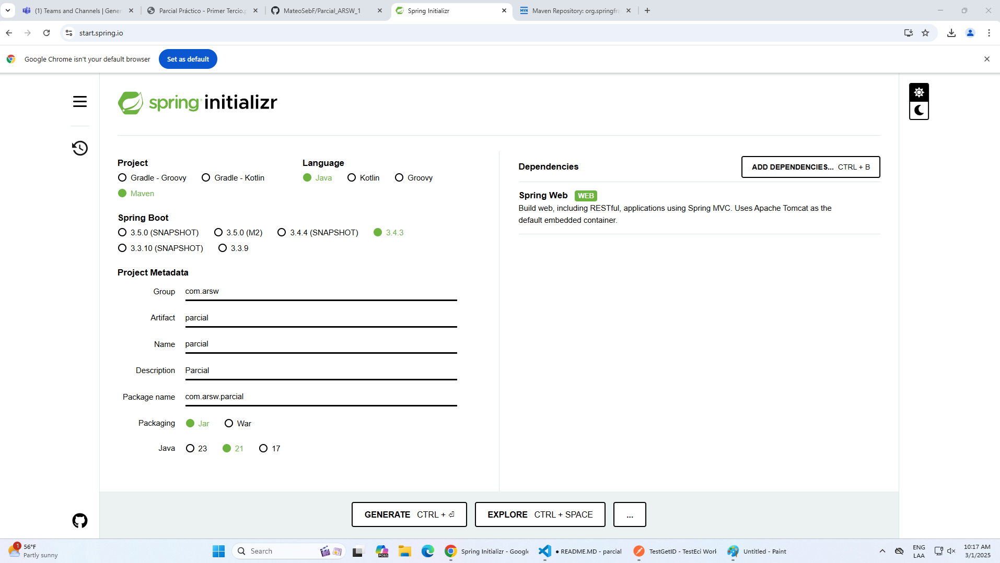
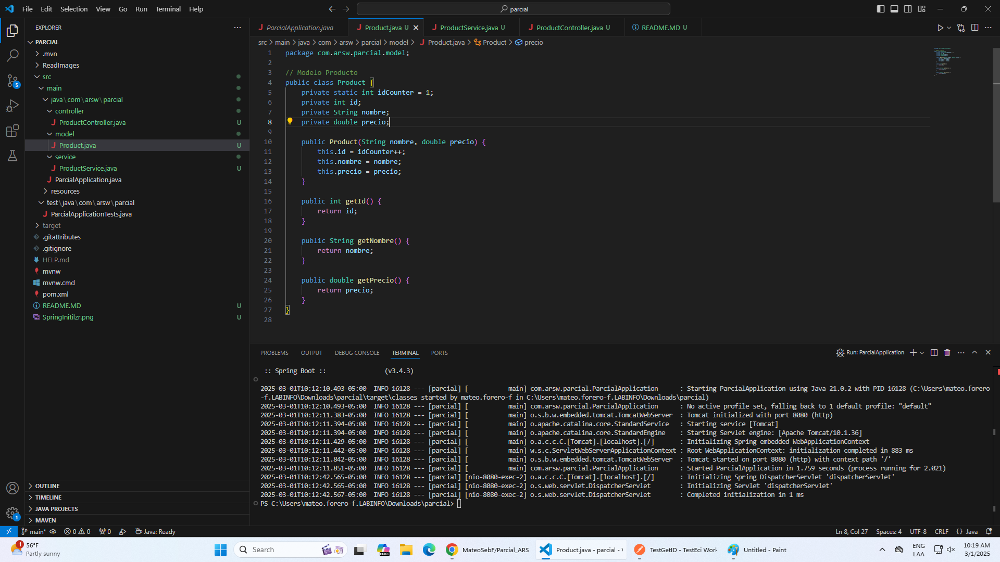
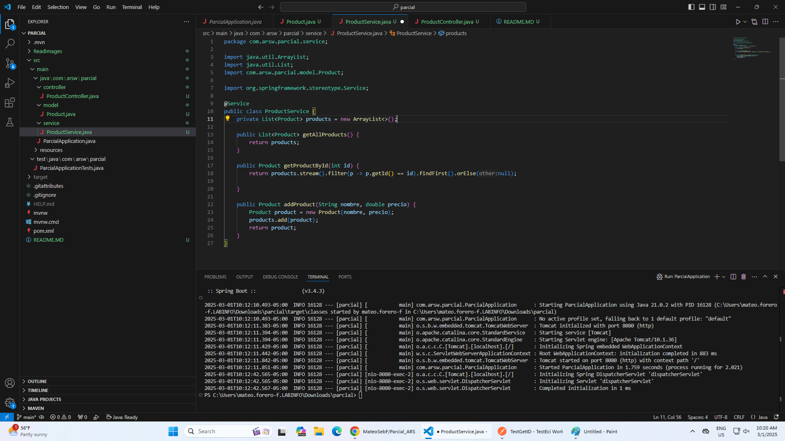
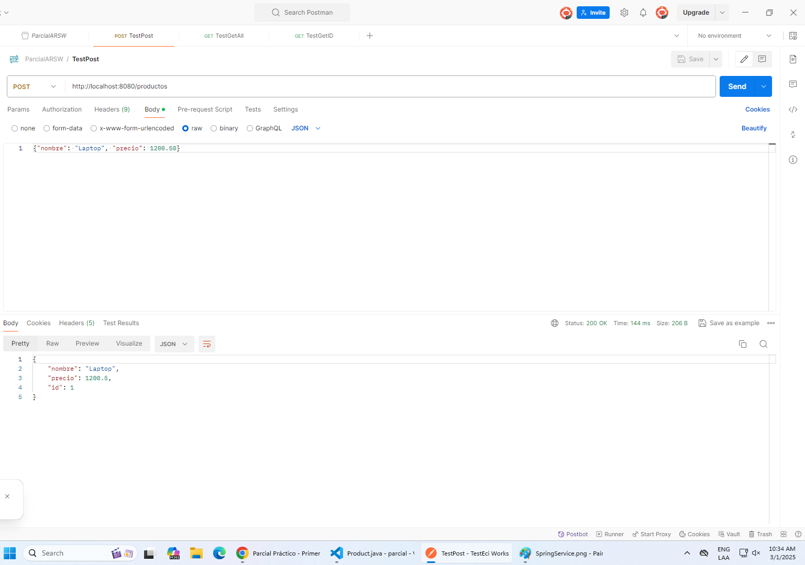
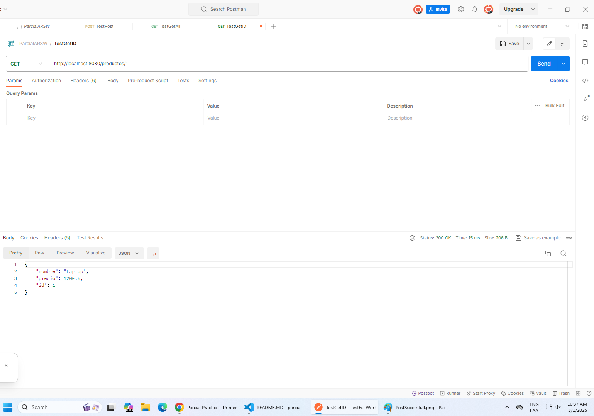
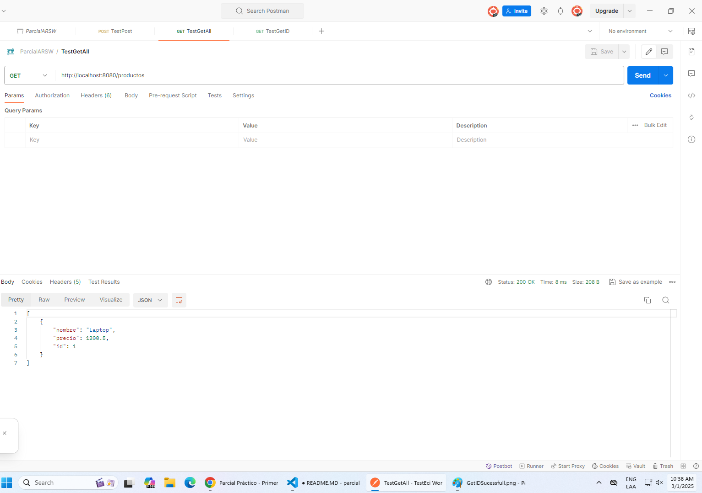
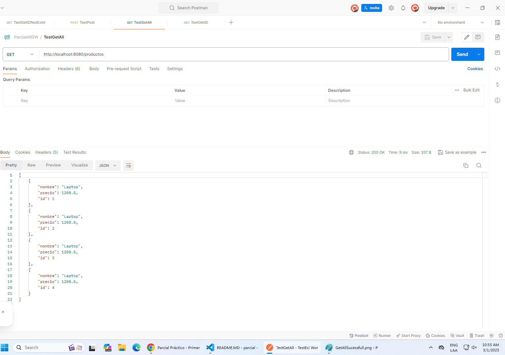
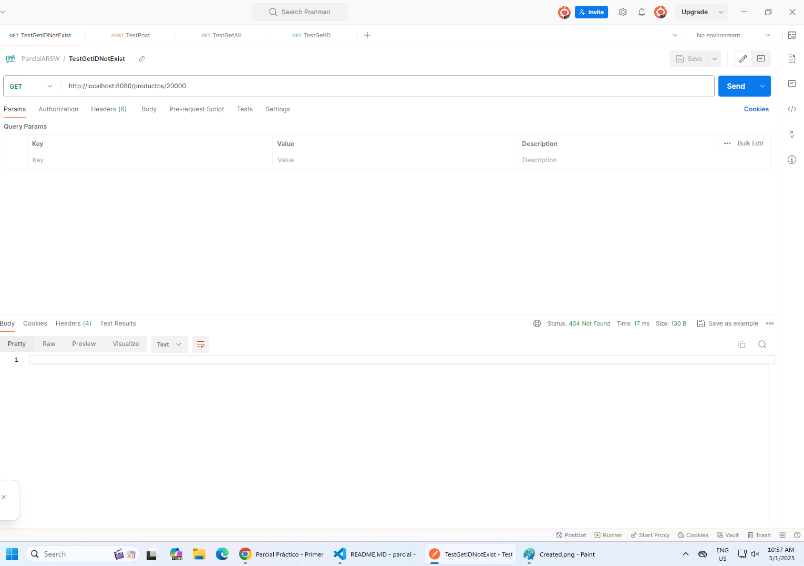
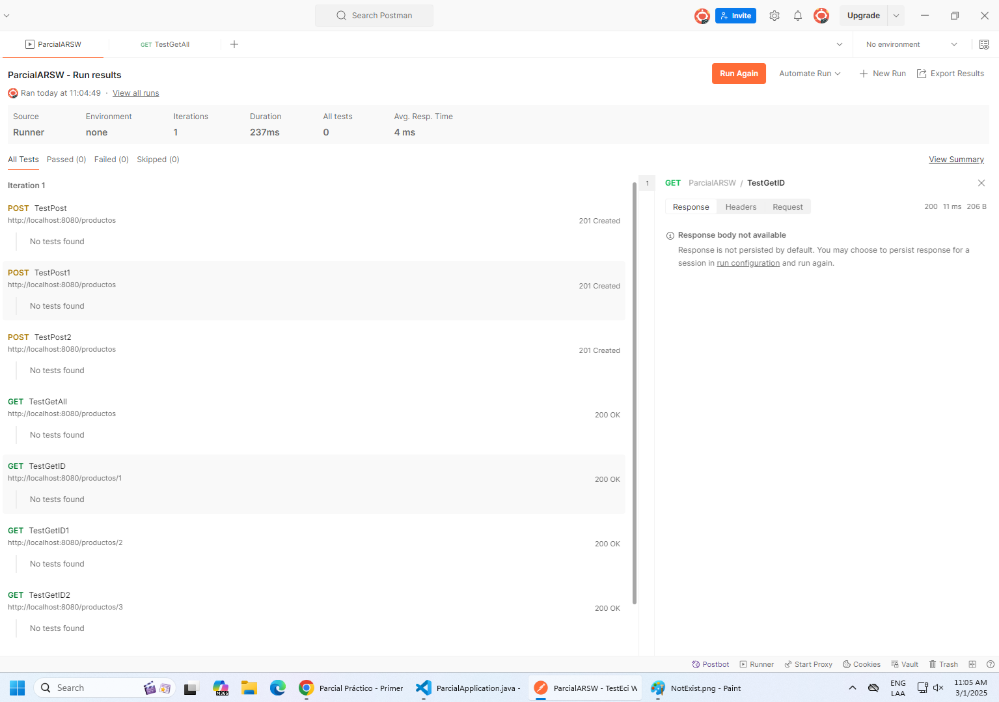
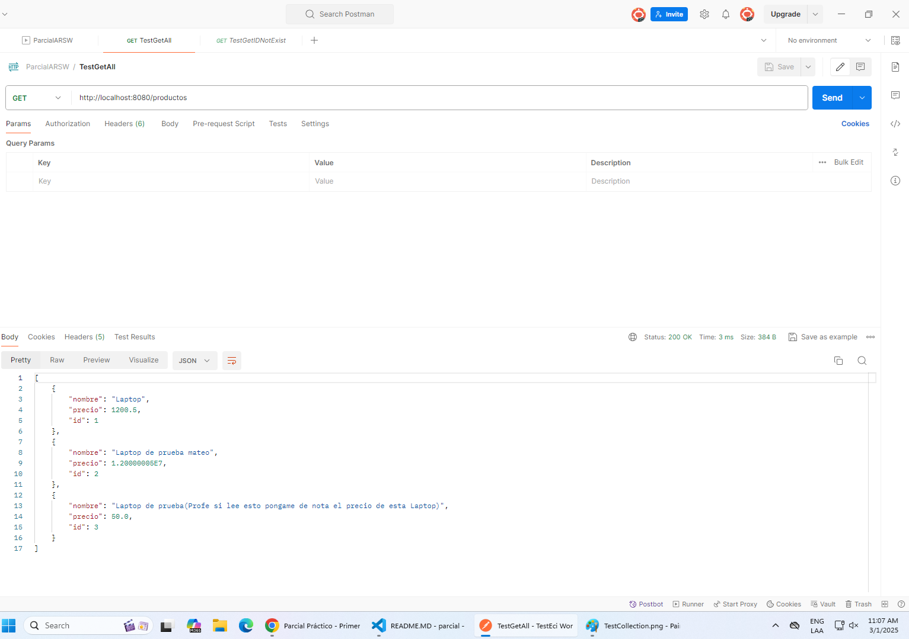

## SOLUCION PARCIAL
## Mateo Sebastian Forero Fuentes

1. Creacion de repositorio con SpringInitializr usando maven, java version 21 y la dependencia de SpringWeb.

2. Uso de las ayudas para la crecion de las clases y crecion de los paquetes model, service y controller.

3. Teniendo las clases creadas solo necesitamos resolver los imports faltantes y añadir la visibilidad a las clases, un ejemplo de service es el siguiente.

4. Cuando hayamos realizado los pasos anteriores podemos evaluar como es el funcionamiento de nuestros distintos metodos, a contiunuacion se observa el metodo post en postman:

5. Metodo get de un solo elemento usando la id:

6. Metodo get de todos los elementos:

7. Debido al funcionamiento de las peticiones cuando se hace un Post y se le pasa un JSON de producto se crea una instancia de ese objeto aumentando asi el id, afectando la integridad de nuestros productos, para esto se modifco la forma del post para cumplir la integridad y eso da el siguiente resultado:

8. Ademas de eso se modifico el controlador para devolver ResponseEntitiy esto para poder administrar de mejor forma los status code:

9. Para validar el funcionamiento correcto del programa se hicieron tres post con distintas laptops, la collecion en postman se ñade en el archivo ParcialARSW.postman_collection.json, los resultados se ven a continuacion:

